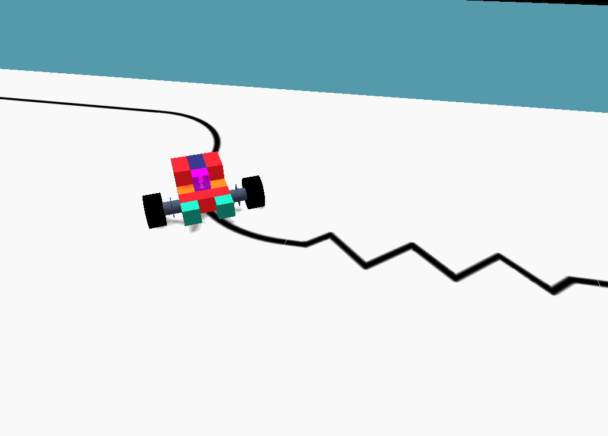

<br>
<p align="center">
	
    <br>
    <sup>An acessible Robotics Kit, from the comfort of your chair.</sup>
</p>
<hr>

<br>

<h3 align="center">
	The official C# programming reference
</h3>
<p align="center">
    For non-commerical (educational) purposes <i>only</i>.
    <br>
    <sup>
        <a href="#portuguese"> Português</a> 
        &nbsp;•&nbsp;
        <a href="#english"> English</a>
    </sup>
</p>

<p align="center">
	<strong>
		<a href="https://sbotics.net">Website</a>
		•
		<a href="https://docs.sbotics.net">Documentation</a>
	</strong>
</p>

<br>

<p align="center">
	
</p>

<br>

--------------
<h2 id="english">  &nbsp;English </h2> 

### Allowed namespaces 
Due to the destructive nature of an in-game compiler, players are only allowed to use a handful of namespaces:

**Present in this repository:**
* `sBotics.Robot`;
* `sBotics.CodeUtils`.

**Other allowed namespaces:**
* `System`;
* `System.Collections`;
* `System.Diagnostics`;
* `System.Threading.Tasks`;
* `System.Collections.Generic`.

### Accessibility and `__sBotics__`
Classes, methods, properties and variables that start with `__sBotics__`, regardless of its accessibility level, are off-limits to the user and are only present in this repository as some of them are important to better understand the "inner workings" of some classes.

> That is, only things marked as *public* and that don't have the special `__sBotics__` keyword can be accessed by users in the programming window.

```cs
// Public and accessible
public static double Modulo(double value, double mod) => (value % mod + mod) % mod;

// Private
double ToSoundPitch(double hz) => (hz * 264 / 5933);

// Reserved
public override void __sBotics__Activate() => TurnOff();
```

### Components and Sensors
Every block that can be programmed in sBotics is called a "component". Every component has two reserved methods: `__sBotics__Activate()` and `__sBotics__Deactivate()`.

The former is always called when a new game starts and the latter when a game finishes.

Sensors are components that have a `Digital` boolean property. Some sensors may have an `Robot.ColorSensor.Analog` property as well, returning different types (e.g. ColorSensor returning a ProgrammingUtils.Color object).

--------------
<h2 id="portuguese">  &nbsp;Português (Brasileiro) </h2> 

### Namespaces permitidos
Dada a natureza destrutiva de um compilador embutido, usuários podem utilizar apenas alguns namespaces em suas programações:

**Presentes neste repositório:**
* `sBotics.Robot`;
* `sBotics.CodeUtils`.

**Outros namespaces permitidos:**
* `System`;
* `System.Collections`;
* `System.Diagnostics`;
* `System.Threading.Tasks`;
* `System.Collections.Generic`.

### Acessibilidade e `__sBotics__`
Classes, métodos, propriedades e variáveis que começam com `__sBotics__`, independente de seu nível de acesso, não podem ser utilizadas pelos usuários e estão presentes neste repositório apenas por serem importantes para melhor entender o "funcionamento interno" de algumas classes.

> Isto é, apenas coisas marcadas como *public* e que não possuem a palavra-chave especial `__sBotics__` podem ser acessadas a partir da janela de programação.

```cs
// Público e acessível
public static double Modulo(double value, double mod) => (value % mod + mod) % mod;

// Privado
double ToSoundPitch(double hz) => (hz * 264 / 5933);

// Reservado
public override void __sBotics__Activate() => TurnOff();
```

### Componentes e Sensores
Todo bloco que pode ser programado no sBotics é chamado de "componente". Todo componente possui dois métodos reservados: `__sBotics__Activate()` e `__sBotics__Deactivate()`.

O primeiro é sempre chamado quando uma nova rotina é iniciada, e o segundo quando a mesma é finalizada.

Sensores são componentes que possuem uma propriedade booleana `Digital`. Alguns sensores também podem possuir uma propriedade `Analog`, retornando tipos diferentes (como o `Robot.ColorSensor.Analog` que retorna um objeto `ProgrammingUtils.Color`)

--------------
## Credits
These credits are not valid for the entire *sBotics Organization*, but were made **specifically** for this repository. While other contributors may appear in the future through github's Pull Request feature, their credit shall remain only on github's contributor section, keeping these credits below intact to be changed only by actual sBotics simulator developers.

* [Lucas Nascimento](https://www.linkedin.com/in/lucas-moura-do-nascimento) - Designed and programmed the current robot programming architecture; 
* [Thiago Nascimento](https://www.linkedin.com/in/txiag) - Implemented `Utils.Map` and the first versions of Robot.UltrasonicSensor and `Robot.TouchSensor`.

--------------

## License and terms
 As sBotics itself is a closed-source software, this repository may serve *only* for educational purposes. You can still fork and create pull-requests on documentation, however, all Unity 3D recreations of the behaviours here programmed must also be open source and for educational purposes, **never** for personal gains or profit.

 Visto que o sBotics em si é um software de código fechado, este repositório deve servir *apenas* para propósitos educacionais. Você pode criar forks e pull-requests relacionados a melhorias de documentação, entretanto toda e qualquer recriação em Unity dos comportamentos aqui descritos devem também ser de código aberto e **jamais** para ganhos pessoais ou lucro.